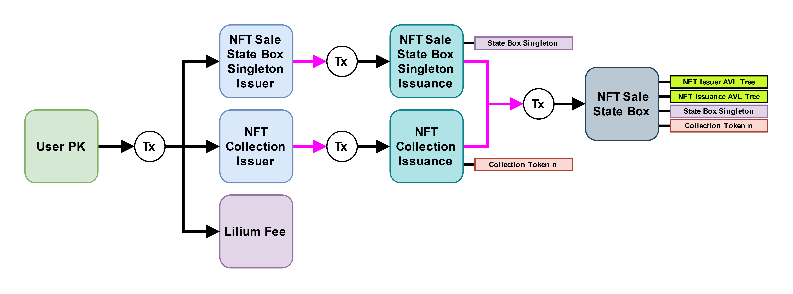
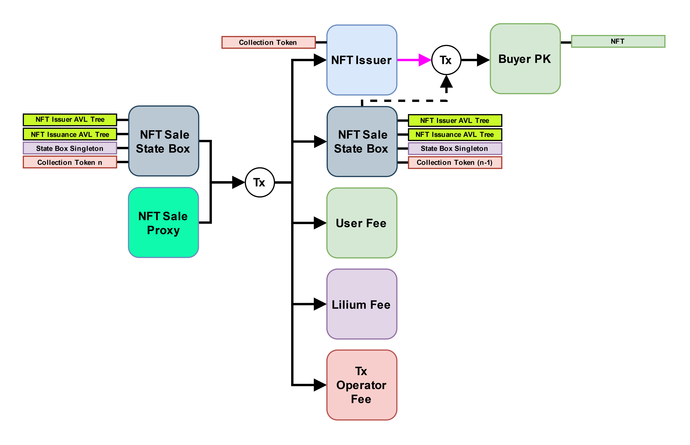
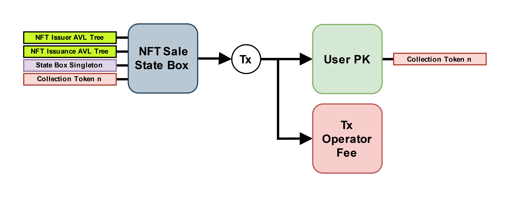
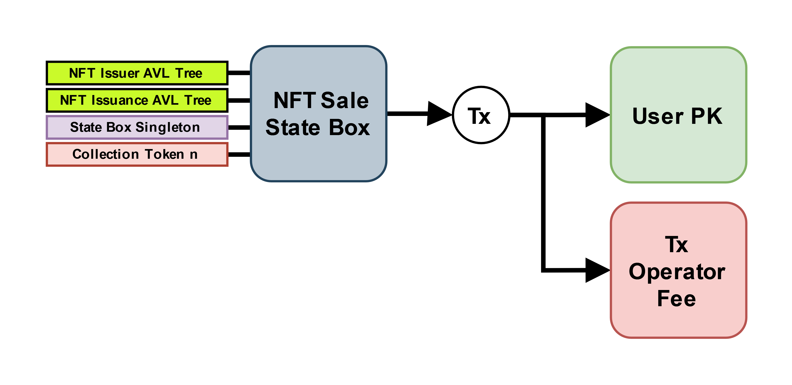
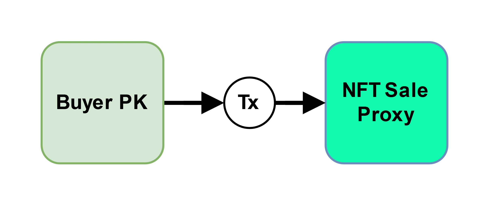
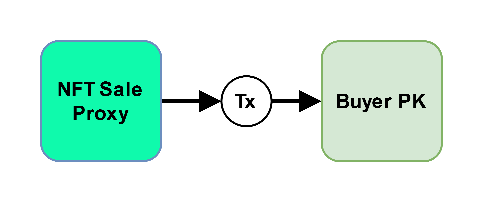
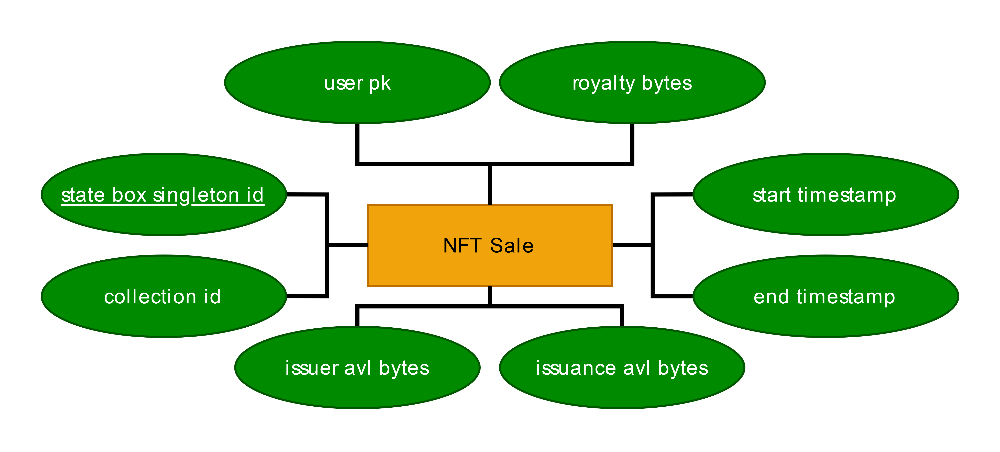

# Lilium Offchain Bot

The off-chain bot that processes every purchase request across all NFT collections.

## Documentation

- Contracts are [here](https://github.com/LiliumErgo/offchain-bot/tree/main/src/main/resources/contracts/Lilium)

## History

The ability to easily deploy NFT collections on Ergo blockchain has traditionally been difficult for developers, and even more so for non-developers. The current NFT space consists mainly of SkyHarbor as the goto NFT marketplace and Ergo Auction House for an auction style experience for selling NFTs. 
With the advent of the NFT collection standard proposed in EIP-34, functionality for collections can now be implemented by developers in their projects.

Born out of ErgoHack 6, Lilium was created to help make it easy for anyone to launch their NFT collection, whether they are an artist or a business. Furthermore, Lilium aims to process NFT sale transaction in a decentralized manner such that anyone can execute them, thus aritsts and businesses need not solely rely on Lilium being up and running.

## Protocol

At the core of the Lilium protocol is the use of AVL trees. They enable us to sell NFTs on-demand by storing the NFT metadata within the AVL tree and only mint the token at the time of the purchase transaction.

The Lilium V1 protocol consists of the following transactions below and provide protocol diagrams for each one.

Note: Miner fee boxes are implicit

### NFT Sale Setup

This is the transaction in which the artist interfaces with the protocol. Here the user would upload all their NFT metadata and this transaction would initiate the creation of the collection tokens and storage of the metadata in the AVL trees. After the payment of the initial fee, Lilium would return the artist with a proxy address to post online.

### NFT Sale

By sending the appropriate amount of funds to the proxy address with their wallet of choice, this transaction would ensure that an NFT is minted with the correct metadata from the AVL trees and subsequently sent to the user. After the transaction is processsed, the buyer should see a newly minted NFT in their wallet.

### NFT Sale End: Return

Once the sale period has expired, if not all NFTs have been sold, the artist has the option of retrieving the remaining collection tokens (not the NFTs, but the collection token which associates a minted NFT to a particular collection).

### NFT Sale End: Burn

Once the sale period has expired, if not all NFTs have been sold, the artist has the option of burning the remaining collection tokens (not the NFTs, but the collection token which associates a minted NFT to a particular collection).

### Buyer Proxy

This transaction is where the buyer of the NFT interacts with the protocol. The buyer sends funds to this proxy address. This creates a new eutxo on the Ergo blockchain which the Lilium bots can pick up and process in the NFT Sale transaction explained above.

### Buyer Proxy: Refund

If the buyer made a mistake and the Lilium bots have not picked up their eutxo yet, the buyer has the option of refunding the funds locked in the proxy address.

## Contracts

We describe the contracts implemented in the Lilium V1 protocol below:

### Collection Issuer

This contract guards the collection issuer box, whose box id will become the token id of the collection tokens (not NFTs).

### Collection Issuance

This contract guards the collection issuance box, which now contains the minted collection tokens (not NFTs). This will check to make sure that the collection tokens are sent to the state box.

### State Box Singleton Issuer

This contract guards the state box singleton issuer, whose box id will become the token id of the state box singleton token. This unique token is used as an identifier of the particular NFT sale in its entirety. 

### State Box Singleton Issuance

This contract guards the state box singleton issuance, which holds the minted state box singleton token. This will check that the singleton token is sent to the state box.

### State Box

The contract guards the state box which ensures all metadata in the AVL trees is used correctly to mint each NFT purchased by the buyer. This box also stores general information about the sale in its registers.

### Buyer Proxy

This is the contract that guards the proxy box which is created when the buyer sends money to the address provided by the artist. The contract will ensure that the funds are used appropriately and that the minted NFT is sent back the buyer.

### NFT Issuer

This contract guards the box that mints the actual NFT, this box id will become the box id of the minted NFT. This box will check that the metadata found in the issuance box is correct.

### NFT Issuance

This box is not guarded by a P2S address but is just a box at the buyer's address. We use a box at the buye's address as dual use with the issuance box, so the registers will contain metadata information about the token following the EIP-4 asset standard.

## Database

For Lilium V1, we are using a PostgreSQL DB, hosted on Supabase, to store information specific to each NFT sale. Notably, the table holds the manifest, digest, and subtree bytes for both the issuer and issuance AVL trees. Our bot then reads from this table in order to obtain the necessary information from each AVL tree, reconstructing it locally. 

For Lilium V2, we aim to instead sync the AVL tree using previous transactions from the Ergo blockchain. Due to time constraints from the hackathon we opted to use the DB approach. In the future, if we ever do use a DB, it will only be for storing information necessary for the website and nothing that would prevent a user from self-hosting the sale themself in the absence of Lilium as a service.

Below, we show our entity-relation (ER) model diagram for the DB, along with the relation. For simplicity, we only use one table to store information. We only write to it during initialization of the sale. The DB is only read thereafter by the bots for each NFT sale transaction that they process.

## Backend